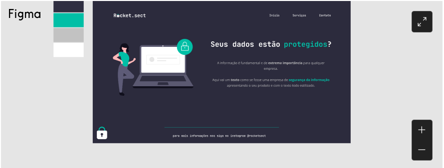
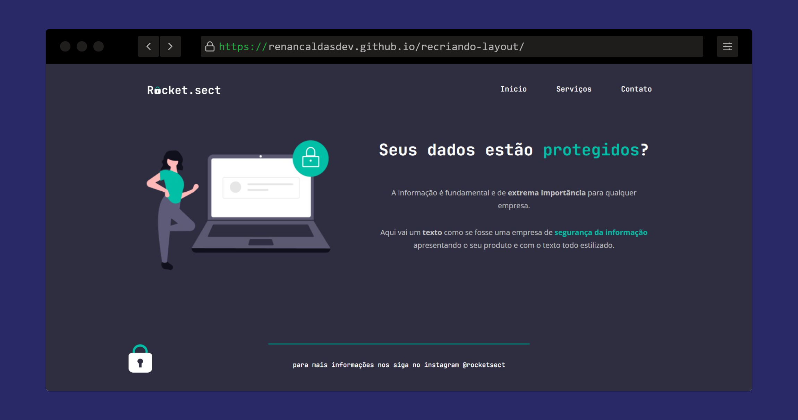

<h1 align="center">
  
</h1>

# 💻 Sobre o desafio

Nesse desafio, você deverá recriar uma aplicação, a partir de um layout, para treinar o que aprendeu até agora no **Stage 02**.

## Figma da aplicação

O figma da aplicação está disponível no [**link**](https://www.figma.com/file/EdKjPWjC8ZlbnH4XzTObv2/Explorer/duplicate) abaixo:

 

### 🚀 Tecnologias Utilizadas

- HTML
- CSS

#### 🚧 Projeto

Live preview: <a href="https://renancaldasdev.github.io/recriando-layout/">Recriando Layout</a>

---

Feito com toda a dedicação 👨‍💻 por Renan Caldas

